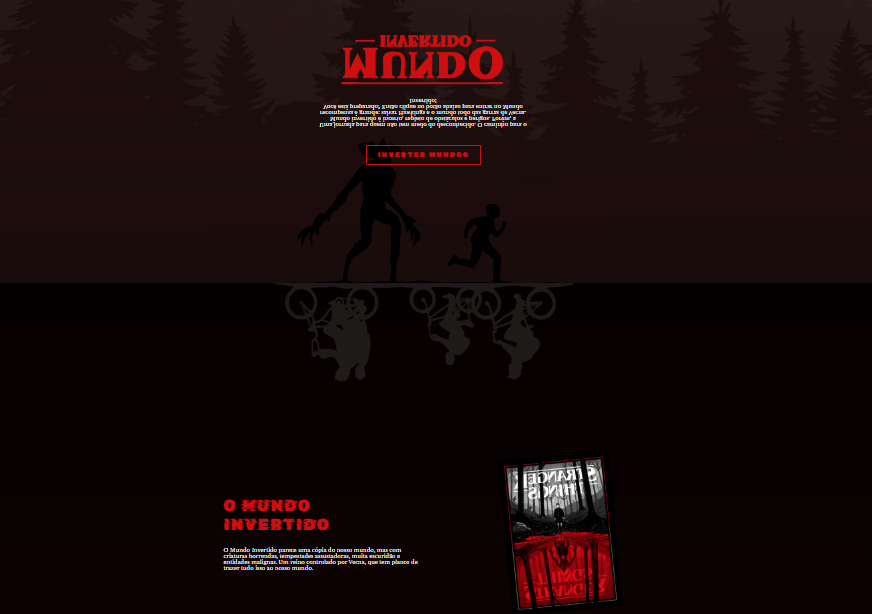
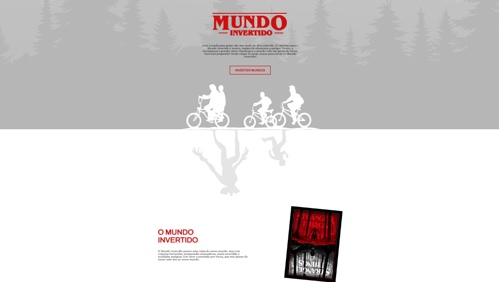

<p align="center">
    
</p>

-------
# Mundo Invertido | Semana Front-end

Bem-vindo ao "Mundo Invertido", um projeto de front-end desenvolvido como parte da **Semana Front-end** da [DIO](https://web.digitalinnovation.one/). Este projeto simula a navegação por um mundo inspirado em **Stranger Things**, combinando design dinâmico com interações baseadas em JavaScript.

## 📖 Sobre o Projeto

Este projeto foi desenvolvido para colocar em prática os conhecimentos adquiridos sobre **HTML**, **CSS** e **JavaScript**. Ele traz uma experiência de navegação em que os usuários podem explorar o mundo de "Stranger Things" e seus elementos, além de interagir com a interface ao alternar entre os temas **Claro** e **Escuro**.

- **Tema Claro**: Simula o mundo normal.
- **Tema Escuro**: Simula o "Mundo Invertido", com imagens e cores alteradas para representar o universo sombrio de Stranger Things.

## 🚀 Funcionalidades

- **Alternância de Tema**: O usuário pode alternar entre o tema Claro e Escuro.
- **Música de Fundo**: Uma música ambiente que é reproduzida automaticamente ao acessar a página.
- **Galeria de Imagens**: Imagens relacionadas ao Mundo Invertido e Stranger Things.
- **Vídeo Integrado**: Um trailer de Stranger Things Vol. 4.
- **Formulário de Inscrição**: Os visitantes podem se inscrever para "entrar no Clube Dungeons & Dragons" de Hawkins.
- **Elementos Invertidos**: Vários elementos visuais são invertidos dependendo do tema, oferecendo uma imersão no conteúdo.

## 🖥️ Tecnologias Usadas

- **HTML5**
- **CSS3** (com variáveis, transições e manipulação de temas)
- **JavaScript** (para alternância de temas e manipulação de elementos dinâmicos)
- **Google Fonts** (tipografia)

## 🔧 Como Rodar o Projeto

### Requisitos
- Navegador moderno com suporte a JavaScript e CSS.

### Passos para execução

1. Clone o repositório para o seu computador:
    ```bash
    git clone https://github.com/seu-usuario/mundo-invertido.git
    ```

2. Navegue até o diretório do projeto:
    ```bash
    cd mundo-invertido
    ```

3. Abra o arquivo `index.html` no seu navegador de preferência para visualizar o projeto.

4. Para editar e desenvolver o projeto, basta abrir os arquivos HTML, CSS e JavaScript em um editor de texto de sua escolha, como [VS Code](https://code.visualstudio.com/).

## 🖼️ Capturas de Tela




*Imagem do Mundo Invertido e Tema Claro*

## 🔄 Como Funciona a Alternância de Temas

Ao clicar no botão **Inverter Mundos**, o tema da página será alterado entre o **Claro** e o **Escuro**:

- O tema **Claro** apresenta o layout padrão e elementos coloridos.
- O tema **Escuro** simula o Mundo Invertido, mudando o fundo, as imagens e até mesmo a tipografia.

## 🧑‍🤝‍🧑 Contribuindo

Se você quiser contribuir com este projeto, fique à vontade para fazer um **fork** e submeter **pull requests**. 

1. Faça o **fork** do repositório
2. Crie uma nova branch:
    ```bash
    git checkout -b minha-contribuicao
    ```
3. Faça as alterações necessárias e **commit** as mudanças:
    ```bash
    git commit -am 'Adicionando nova funcionalidade'
    ```
4. **Push** para a sua branch:
    ```bash
    git push origin minha-contribuicao
    ```
5. Abra um **pull request** no GitHub para revisar suas alterações.

## 📚 Licença

Este projeto está licenciado sob a licença **MIT**. Veja o arquivo [LICENSE](LICENSE) para mais detalhes.

## 👨‍💻 Autor

Este projeto foi criado por [Seu Nome](https://github.com/ruuanmanoel) como parte do aprendizado na Digital Innovation One.

---

Sinta-se à vontade para ajustar o projeto conforme necessário e explorar novas funcionalidades! Boa sorte, e que o Mundo Invertido não te devore! 😱
